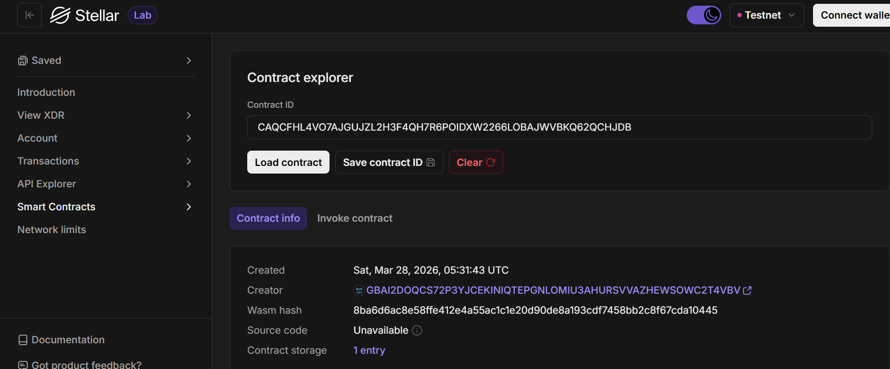

# Stellar Contacts DApp

**Stellar Contacts DApp** - Blockchain-Based Decentralized Phone Contacts System

## Project Description

Stellar Contacts DApp is a decentralized smart contract solution built on the Stellar blockchain using Soroban SDK. It provides a secure, immutable platform for managing personal phone contacts directly on the blockchain. The contract ensures that your data is stored transparently and is only manageable through predefined smart contract functions, eliminating reliance on centralized database providers.

The system allows users to create, view, and delete phone contacts, leveraging the efficiency and security of the Stellar network. Each contact is uniquely identified and stored within the contract's instance storage, ensuring data persistence and reliability.

## Project Vision

Our vision is to revolutionize personal contact management in the digital age by:

- **Decentralizing Data**: Moving address books from centralized servers to a global, distributed blockchain
- **Ensuring Ownership**: Empowering users to have complete control and ownership over their contact lists
- **Guaranteeing Immutability**: Providing a permanent, tamper-proof record of contacts that cannot be altered or deleted by third parties
- **Enhancing Privacy**: Leveraging blockchain security to protect personal information from unauthorized access
- **Building Trustless Systems**: Creating a platform where data integrity is guaranteed by code, not by company promises

## Key Features

### 1. **Simple Contact Creation**

- Create contacts with just one function call
- Specify name and phone number for each contact
- Automated ID generation for unique identification
- Persistent storage on the Stellar blockchain

### 2. **Efficient Data Retrieval**

- Fetch all stored contacts in a single call
- Structured data representation for easy frontend integration
- Quick access to your entire contact list
- Real-time synchronization with the blockchain state

### 3. **Secure Deletion**

- Remove specific contacts using their unique IDs
- Permanent removal from the contract storage
- Clean and efficient storage management
- Immediate update of the contact list after deletion

### 4. **Transparency and Security**

- View all contact activities on the blockchain
- Blockchain-based verification of all storage actions
- Immutable records of contact creation and deletion
- Protected against unauthorized modifications

### 5. **Stellar Network Integration**

- Leverages the high speed and low cost of Stellar
- Built using the modern Soroban Smart Contract SDK
- Scalable architecture for growing contact lists
- Interoperable with other Stellar-based services

## Contract Details

- Contract Address: CAQCFHL4VO7AJGUJZL2H3F4QH7R6POIDXW2266LOBAJWVBKQ62QCHJDB
  

## Future Scope

### Short-Term Enhancements

1. **Contact Encryption**: Support for end-to-end encryption of contact details for enhanced privacy
2. **Category Management**: Add tags and groups to organize contacts efficiently
3. **Additional Fields**: Extend support beyond name and phone number to include email, address, and social handles
4. **Search Functionality**: Implement advanced search filters for large contact lists

### Medium-Term Development

5. **Collaborative Contacts**: Implement multi-signature requirements for shared contact lists
6. **Notification System**: Off-chain bridge to alert users of new updates or shared contacts
7. **Asset Attachment**: Capability to attach digital assets to specific contacts
8. **Inter-Contract Integration**: Allow other smart contracts to interact with and read data from the contacts contract

### Long-Term Vision

9. **Cross-Chain Synchronization**: Extend contact storage to multiple blockchain networks
10. **Decentralized UI Hosting**: Host the frontend on IPFS or similar decentralized platforms
11. **Privacy Layers**: Implement zero-knowledge proofs for completely private contact lists
12. **Identity Management**: Integration with decentralized identity (DID) systems for user management

---

## Technical Requirements

- Soroban SDK
- Rust programming language
- Stellar blockchain network

## Getting Started

Deploy the smart contract to Stellar's Soroban network and interact with it using the three main functions:

- `create_contact()` - Create a new contact with a name and phone number
- `get_contacts()` - Retrieve all stored contacts from the contract
- `delete_contact()` - Remove a specific contact by its ID

---

**Stellar Contacts DApp** - Securing Your Contacts on the Blockchain
